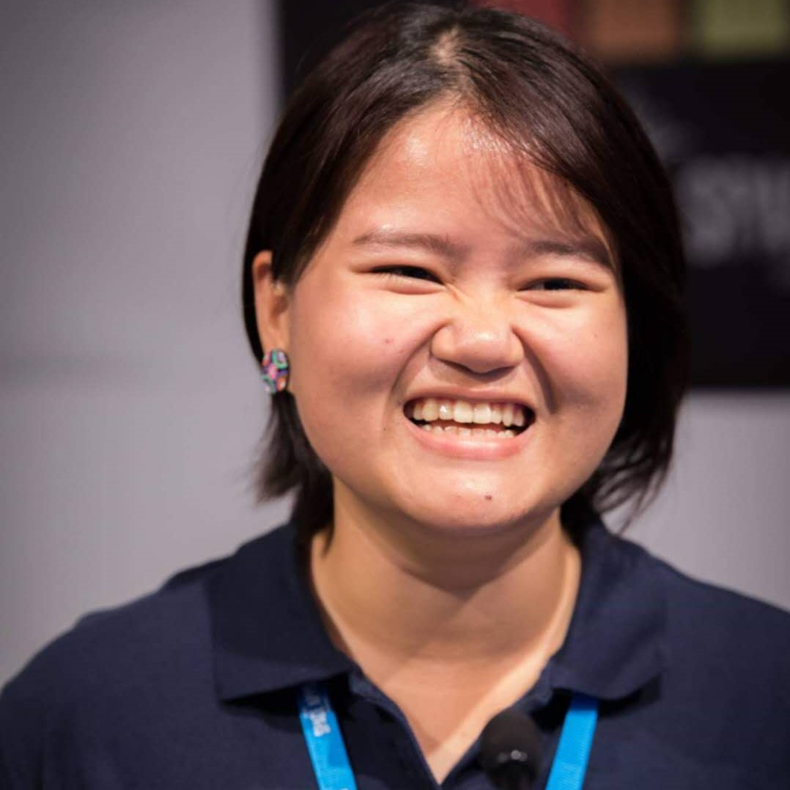
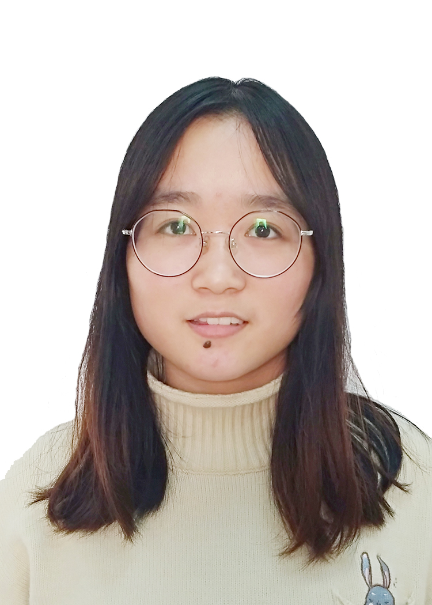

[Home](./index.md)

	
# Alumni

<table>

<tr>
<td width="120">
    
</td>
<td>

<b>Abaz Shehu</b>, Honours student, 2018  
<!-- 2018- -->

Now (2019): Graduated from the University of Edinburgh

<!-- 
 -->
<!-- Hi, I'm an undergraduate neuroscience student with a keen interest in learning and memory. I'm excited to expand my knowledge in this field through my research project, which is on the molecular mechanisms of spaced repetition learning.  -->
<!-- 
 -->
</td>
</tr>

<tr>
<td width="120">
    
</td>

<td>

<b>Adele Valeria</b>,  Summer student (co-supervised with Sebastian Leptihn), 2021  

Now (2025): PhD student, Johns Hopkins University (US).

</td>
</tr>

<tr>
<td width="120">
    <!--  -->
</td>

<td>

<b>Adrian Trajlinek</b>,  Honours student (co-supervised with David Sterratt), 2021-2022  
<!-- 2021-- -->

Now (2022): Graduated from the University of Edinburgh

</td>
</tr>

<tr>
<td width="120">
    
</td>
<td>

<b>Aleksandra Slawinska</b>, MSc student (co-supervised with Joanne Murray), 2019-20  
<!-- 2019- -->

Now (2022): PhD student in Precision Medicine, University of Edinburgh
<!-- 
 -->
<!-- I am MSc by Research Biomedical Sciences student with a particular interest in cellular signalling. I am involved in the project based on the G-protein coupled receptor activation by growth hormone. I am trying to combine in vitro studies using luminescence assays as well as in silico analysis using computational modelling to gain more insight into the cellular processes occurring. I am planning to continue my career as an academic researcher, particularly in the area of cellular communication. -->
<!-- 
 -->

<a href="https://www.linkedin.com/in/aleksandra-slawinska-70999b131">https://www.linkedin.com/in/aleksandra-slawinska-70999b131 </a>

</td>
</tr>

<tr>
<td width="120">
    <!--  -->
</td>
<td>

<b>Alice Salla</b>, High school intern  
<!-- 2024- -->

  Now (2025): Student at Lycée Général et Technologique Georges Duby
<!-- My name is Alice Salla , I'm 15 and I'm passionate about dance and music. I love playing piano and using my body to express emotion. I would love to learn more about how anxiety and stress affects our -->
<!-- brain and our body and how to regulate it. I also love traveling and discovering other countries' culture and education systems and how it affects people's mental health . -->

</td>
</tr>

<tr>
<td width="120">
    
</td>
<td>

<b>Ayisha Mahmood</b>, Summer student, 2018  

Now (2022): PhD student in Reproductive Health, University of Edinburgh

</td>
</tr>

<!-- C -->
<tr>
<td width="120">
    <!--  -->
</td>

  
<td>

<b>Carine Candel</b>, MSc student (co-supervised with <a href="http://homepages.inf.ed.ac.uk/sterratt/">David C. Sterratt</a>), 2019  
<!-- 2019- -->

Now (2022): Corporate Graduate at Nationwide

<a href="https://www.linkedin.com/in/carine-candel-961953187/">https://www.linkedin.com/in/carine-candel-961953187/</a>

</td>
</tr>

<tr>
<td width="120">
   
</td>
 
<td>

<b>Chenge (Joanna) Du</b>, Honours student (co-supervised with Xianghua Li), 2021-2022  
<!-- 2021--- -->

Now (2023): MPhil student in Health Data Science at the University of Cambridge

</td>
</tr>

<tr>
<td width="120">
   
</td>
<td>

<b>Connor Schlemmer</b>, Summer student, 2019   
<!-- 2019- -->

Now (2022): Graduated from the University of Edinburgh

<a href="https://www.linkedin.com/in/connor-schlemmer-6a907719b">https://www.linkedin.com/in/connor-schlemmer-6a907719b</a>

</td>
</tr>

<tr>
<td width="120">
    
</td>
<td>

<b>Domas Linkevicius</b>, PhD student (co-supervised with David Sterratt) 2020-2025  
<!-- 2020- -->

<!-- 
 -->
<!-- My interests primarily lie in modelling neuronal dynamics (mainly synaptic plasticity) as an interplay of electrical and biochemical activity at the level of single cells. I am interested in trying to understand how various studies on synaptic plasticity and neuronal dynamics could be reconciled (if at all) via models built in a bottom-up fashion that can explicitly include experimental conditions and assumptions whenever feasible. My interests also include trying to tackle the complexity of and shortage of data on the post-synaptic proteome by using machine learning. -->
<!-- 
 -->

Now (2025): Postdoctoral research fellow, Okinawa Institute of Science and Technology (JP).

</td>
</tr>

<tr>
<td width="120">
    
</td>
<td>

<b>Dulmini Hasara (Becky) Pathirana</b>, Summer student,  Honours student, 2020-2021 

Now (2022): Graduated from the University of Edinburgh

</td>
</tr>

<tr>
<td width="120">
  
</td>

<td>

<b>Edon Aliko</b>,  Honours student (co-supervised with David Sterratt) (2020-2021)  

Now (2022): Software Engineer at Improbable

</td>
</tr>

<tr>
<td width="120">

    

</td>
<td>

<b>Excellence Ogunbayo</b>, Nuffield Summer student, 2016  

 
Now (2018): Medical student

</td>
</tr>

<!-- G -->

<tr>
<td width="120">
   
</td>
<td>

<b>Giorgos Rodamnakis</b>, MSc student, 2019  
<!-- 2019- -->

Now (2020): completing military service in Greece

</td>
</tr>

<tr>
<td width="120">
    
</td>

<td>

<b>Grace Chin</b>,  Summer student (co-supervised with Sebastian Leptihn), 2021  

Now (2022): Third-year student in Biomedical Science, University of Edinburgh and Zhejiang University, Haining (CN). 

</td>
</tr>

<tr>
<td width="120">
    
</td>
<td>

<b>Grant Herpich</b>, Honours student, 2018  
<!-- 2018- -->

Now (2022): Graduated from the University of Edinburgh

  <a href="https://www.linkedin.com/in/grant-herpich-6b3849173/">https://www.linkedin.com/in/grant-herpich-6b3849173/</a>

</td>
</tr>

<tr>
<td width="120">

</td>
<td>

<b>Isla Smith</b>, Nuffield Summer student, 2017 

Now (2017): Student, Galashiels Academy
<!-- I am currently taking part in a Nuffield Research Placement with the Stefan lab. My placement involves using computational models to investigate cooperative binding in proteins. The aim of my research is to explain this occurence in the micro world to an example in the macro world through applying the theory of cooperative binding in proteins to the collection of Panini football cards. -->

</td>
</tr>

<tr>
<td width="120">
    
</td>
<td>

<b>James Schofield</b>, Honours student, 2019  
<!-- 2019- -->

Now (2022): Assistant Auditor at UK National Audit Office

  <a href="https://www.linkedin.com/in/james-a-schofield/">https://www.linkedin.com/in/james-a-schofield/</a>

</td>
</tr>

<tr>
<td width="120">
    
</td>
<td>
  

<b>Jana Fin&#158;gar</b>, Honours student, Research assistant, 2017  
 <!-- <b>Jana Fin&#158;gar</b>, Honours student, 2017   -->

Now (2020): Operations Manager at RU-FI d.o.o
<!-- I am interested in working with computers and incorporating computer models in the research of biological events. Especially fascinating is the intricate connectivity and cellular events that govern memory induction and learning and how we can use models to visualize and manipulate data. -->

  <a href="https://www.linkedin.com/in/jana-fin%C5%BEgar-897b85136/">https://www.linkedin.com/in/jana-fin%C5%BEgar-897b85136/</a>

</td>
</tr>
  

<tr>
<td width="120">
    
</td>
<td>

<b>Jes&uacute;s Cabrera &Aacute;lvarez</b>, MSc student, 2019  
<!-- 2019- -->

Now (2022):  Researcher Trainee, Universidad Complutense de Madrid (ES).

<a href="https://www.linkedin.com/in/jesús-cabrera-álvarez-92136712a">https://www.linkedin.com/in/jesús-cabrera-álvarez-92136712a</a> 

</td>
</tr>

<tr>
<td width="120">
    
</td>
<td>

<b>Jing Xie</b>, MSc student (co-supervised with Emanuel Busch), 2020-2021  
<!-- 2020- -->

Now (2025): PhD student, University of Hong Kong. 

</td>
</tr>

<tr>
<td width="120">
    
</td>
<td>

<b>Junhan (John) Lou</b>, Visiting student, 2020   
<!-- 2020- -->

Now (2022): Graduated from the University of Edinburgh and Zhejiang University, Haining (CN).

</td>
</tr>

<tr>
<td width="120">
    
</td>
<td>

<b>Kadri Pajo</b>, Visiting MSc student, 2016  

Now (2020): PhD student in Neuroscience, Karolinska Institute, Stockholm (SE)

<a href="https://se.linkedin.com/in/kadri-pajo-30a50555">https://se.linkedin.com/in/kadri-pajo-30a50555</a>

</td>
</tr>

<tr>
<td width="120">
    
</td>
<td>

<b>Kyle Robertson</b>, Nuffield Summer student, 2018  

<!-- 
 -->
<!-- I'm a Nuffield Research placement student, I'm currently working on a computational model of the Sonic Hedgehog signalling pathway. My model will hopefully be able to help find causes or cures for disorders such as holoprosencephaly. -->
<!-- 
 -->

Now (2018): Student, Wallace High School

</td>
</tr>

<tr>
<td width="120">
    
</td>
<td>

<b>Kyungsuk (Pierce) Ryu</b>, Honours student, 2018  
<!-- 2018- -->

Now (2020): Military service in the Republic of Korea

<a href="https://www.linkedin.com/in/pierce-ryu-8b521b157/">https://www.linkedin.com/in/pierce-ryu-8b521b157/</a>

</td>
</tr>

<tr>
<td width="120">

</td>

<td>

<b>Lenka Porteous</b>, Honours student, 2021-2022  
<!-- 2020--- -->

Now (2025): Nursing student, University of Edinburgh

</td>
</tr>

<tr>
<td width="120">
    
</td>
<td>

<b>Lewis Strachan</b>, Nuffield Summer student, 2017 

Now (2020): BSc student in Biochemistry, University of Edinburgh

<a href="https://www.linkedin.com/in/lewis-strachan-29b306129/">https://www.linkedin.com/in/lewis-strachan-29b306129/</a>

<!-- 
 --> 
<!-- I am currently undertaking a Nuffield Research Placement within the Stefan Lab, modelling the function and regulation of FMRP - an important protein in conditions like Fragile X Syndrome and autism. I will be overseen by Dr Stefan and Richard Fitzpatrick. -->
<!-- 
 -->
</td>
</tr>

<tr>
<td width="120">
    
</td>

<td>

<b>Lifei (Crystal) Jiang</b>, Visiting student, 2019  
<!-- UG, 2019- -->

Now (2022):  PhD Student at Princeton University

</td>
</tr>

<tr>
<td width="120">
    
</td>
<td>

<b>Marcel Kazmierczyk</b>, Honours student, Summer student (co-supervised with <a href="https://www.ed.ac.uk/discovery-brain-sciences/our-staff/research-groups/mayank-dutia">Mayank Dutia</a>), 2018  
<!-- Honours student 2018- -->

Now (2022): Junior Doctor, NHS 
  

<a href="https://www.linkedin.com/in/marcel-ka%C5%BAmierczyk-35a52761/">https://www.linkedin.com/in/marcel-ka%C5%BAmierczyk-35a52761/</a>

</td>
</tr>

<tr>
<td width="120">
    
</td>
<td>

<b>Marios Diamantopoulos</b>, Msc student (co-supervised with <a href="https://www.ed.ac.uk/discovery-brain-sciences/our-staff/research-groups/emanuel-busch">Emanuel Busch</a>), 2018  
<!-- 2018- -->

<!-- 
 -->
<!-- I am an MSc student in Neuroscience with medical background. My interests pertain to neural circuits and neuropsychiatric disorders. I am currently involved in research of calcium signalling in neurons, using combined in vivo (C. Elegans) and in silico (computational modelling) methods. -->
<!-- 
 -->

Now (2019): Graduated from MSc, Integrative Neuroscience, University of Edinburgh

</td>
</tr>

<tr>
<td width="120">
    <!--  -->
</td>
<td>

<b>Naima Elosegui Borras</b>, Honours student (co-supervised with Matthias Hennig), 2020  
<!-- 2020- -->

Now (2020): MS student in Neural Systems and Computation at UZH and ETH 

  <a href="https://www.linkedin.com/in/naima-elosegui-borras-a19aa019a">https://www.linkedin.com/in/naima-elosegui-borras-a19aa019a</a>

</td>
</tr>

<tr>
<td width="120">
    
</td>
<td>

<b>Okuk Takon</b>, Summer student, 2019   
<!-- 2019- -->

Now (2020): Graduated from BSc (Honours) Anatomy and Development, University of Edinburgh

<!-- 
 -->
<!--  I am a student going into 4th year and I have chosen Anatomy and Development as my Honours programme. Studying Anatomy has been beneficial in broadening by structural understanding of the human body and I also found learning about developmental abnormalities in my Developmental Biology course to be very interesting. As such I am looking forward to an academic year dedicated to both disciplines. My third year has also been a great opportunity for me to explore computational modelling and I am keen to see how I can use this in my own 4th year dissertation project. -->
<!-- 
 -->

</td>
</tr>

<!-- P -->

<tr>
<td width="120">
   
</td>
<td>

<b>Patricia Cambalova</b>, Honours student, 2019  
<!-- 2019- -->

Now (2022): DPhil candidate, University of Oxford

  <a href="https://www.linkedin.com/in/patricia-cambalova/">https://www.linkedin.com/in/patricia-cambalova/</a>

</td>
</tr>

<tr>
<td width="120">
    <!--  -->
</td>

<td>

<b>Pedro Fong</b>,  MSc student (co-supervised with David Sterratt), 2020-2022  
<!-- 2020-- -->

Now (2025): Associate Professor, Macau Polytechnic University

</td>
</tr>

<tr>
<td width="120">
    
</td>

<td>

<b>Richard Fitzpatrick</b>, PhD student, 2016-2021  
<!-- 2016- -->

Now (2025): Academic Track Lecturer (Zhejiang), University of Edinburgh

</td>
</tr>

<!-- S -->

<tr>
<td width="120">
    
</td>
<td>

<b>Sagar Arora</b>, Msc student, 2018  
<!-- 2018- -->

<!-- 
 -->
<!-- I am an MSc Neuroscience student currently working on a stochastic model of Calcium signaling in plasticity and its role in Alzheimer's  Disease. My research interests involve learning and memory, and its consolidation in the sleep by combining behavioral studies and computational approaches. -->
<!-- 
 -->

Now (2018): Graduated from MSc Integrative Neuroscience,  University of Edinburgh

  <a href="https://www.linkedin.com/in/sagara016/">https://www.linkedin.com/in/sagara016/</a>

</td>
</tr>

<tr>
<td width="120">
    
</td>
<td>

  <b>Salvador Garc&iacute;a Gonz&aacute;lez</b>,  MSc student (co-supervised with <a href="http://www.sfu.ca/~dgasevic/">Dragan Gasevic</a>), 2017  

Now (2022): University Lecturer in Statistics, Instituto Tecnológico Autónomo de México

<a href="https://www.linkedin.com/in/salvador-garcia-gonzalez-6a24107a/">https://www.linkedin.com/in/salvador-garcia-gonzalez-6a24107a/</a>

</td>
</tr>

<tr>
<td width="120">
    
</td>

<td>

<b>Sara Carrino</b>, Visiting MSc student (co-supervised with Emanuel Busch), 2021-22  
<!-- 
 -->
<!--  Hi All! -->
<!-- 
 -->

Now (2025): Pre-doctoral Research Fellow, University of Cambridge
  

</td>
</tr>

<tr>
<td width="120">
    
</td>

<td>

<b>Shudi Xu</b>, Honours student (co-supervised with Takaki Komiyama at UCSD), 2020-2021  
<!-- 2020- -->

Now (2023): PhD student in Neuroscience, Northwestern University.

</td>
</tr>

<tr>
<td width="120">
    
</td>
<td>
 

<b>Simon Parker</b>, Summer student, 2019   
<!-- 2019- -->

Now (2022): MRes student, Cancer Bioinformatics, Imperial College London (UK)

<a href="https://www.linkedin.com/in/simon-p-523a3190/">https://www.linkedin.com/in/simon-p-523a3190/</a>

</td>
</tr>

<tr>
<td width="120">
    
</td>

<td>

<b>Siobhan Vickerstaff</b>, Honours student, 2020  
<!-- 2020- -->

Now (2020): Master of Public Health student,  University of Edinburgh
<!-- I am an Infectious Diseases BSc Honours student at the University of Edinburgh. My work revolves around using Minecraft to investigate the potential of interactive sandbox environments to emulate complex biomedical models. My interests are in not only Infectious Diseases but how you model their epidemiology and transmission cycles, as well as bioinformatics -->

<a href="https://www.linkedin.com/in/siobhan-vickerstaff-4801671a3">https://www.linkedin.com/in/siobhan-vickerstaff-4801671a3</a>

</td>
</tr> 

<tr>
<td width="120">
   
</td>
<td>

<b>Srivatsan Rajagopalan</b>, Summer student, 2019   
<!-- 2019- -->

Now (2022): Researcher, Children in All Policies 2030

<!-- 
 -->
<!-- My name is Srivatsan Rajagopalan, but everyone calls me Chikku. I am a fourth year Biomedical Sciences (Honours) student. I am from Lusaka, Zambia. I am interested in neurological pathways, epidemiology and toxicology. I am currently part of the study investigating the use of Minecraft to model complex biological processes. -->
<!-- 
 -->

<a href="https://www.linkedin.com/in/srivatsanraj">https://www.linkedin.com/in/srivatsanraj </a>

</td>
</tr>

<!-- <tr> -->
<!-- <td width="120"> -->
<!--      -->
<!-- </td> -->
<!-- <td> -->
<!-- 
 -->
<!-- <b>Susana Rom&aacute;n Garc&iacute;a</b>, Honours student, Research assistant, 2017   -->
<!-- <\!-- <b>Susana Rom&aacute;n Garc&iacute;a</b>, Honours student, 2017   -\-> -->
<!-- <\!-- 2017- -\-> -->
<!-- 
 -->
<!-- 
 -->
<!-- Now (2020): Executive Assistant at Health Infromatics Consulting Ltd -->
<!--   <\!-- I am interested in learning how protein interactions in the brain can lead to complex brain functions like memory. I will be doing my dissertation on the interaction between NMDA receptors and CaMKII in the postsynaptic neuron using computational modelling. -\-> -->
<!-- 
 -->

<!-- 
 -->
<!--   <a href="https://uk.linkedin.com/in/susana-roman-garcia-7a1552125"> https://uk.linkedin.com/in/susana-roman-garcia-7a1552125 </a> -->
<!-- 
 -->

<!-- </td> -->
<!-- </tr> -->

<!-- T -->

<tr>
<td width="120">
    
</td>
<td>

<b>Tara O'Driscoll</b>, MSc student (co-supervised with <a href="http://homepages.inf.ed.ac.uk/sterratt/">David C. Sterratt</a>), 2017  

<!-- 
 -->
<!-- I am currently completing a Master's in Cognitive Science with the School of Informatics. I am particularly interested in the integration of experimental and computational neuroscience in interdisciplinary research. My thesis will involve the computational modelling of CaMKII, investigating the direction of autophosphorylation around and/or across the protein. -->
<!-- 
 -->

Now (2022): PhD student, Univeristy College London and Co-Founder of BoobyBiome

<a href="https://www.linkedin.com/in/tara-o-driscoll-884778113/">https://www.linkedin.com/in/tara-o-driscoll-884778113/</a>

</td>
</tr>                                                       

<tr>
<td width="120">
    
</td>

 
<td>

<b>Thomas Heap</b>, MSc student (co-supervised with <a href="http://homepages.inf.ed.ac.uk/sterratt/">David C. Sterratt</a>), 2019  
<!-- 2019- -->

Now (2022): Research Engineer III, Smarsh

<a href="https://www.linkedin.com/in/thomas-h-998780108">https://www.linkedin.com/in/thomas-h-998780108</a>

<!-- 
 -->
<!-- I am a Master's student in Artificial Intelligence. My interests include Machine Learning and Bayesian Inference. My project is about using Sequential Neural Likelihood to infer posterior distributions for a simulator model of Calmodulin, a protein which plays a role in synaptic plasticity. -->
<!-- 
 -->
</td>
</tr>

<tr>
<td width="120">
    
</td>

   
<td>

<b>Tom Bain</b>, MSc student (co-supervised with <a href="http://homepages.inf.ed.ac.uk/sterratt/">David C. Sterratt</a>), 2019  
<!-- 2019- -->

Now (2022): Software Engineer at Obex Technologies

<a href="https://www.linkedin.com/in/thomas-bain">https://www.linkedin.com/in/thomas-bain</a>

<!-- 
 -->
<!-- I am an MSc Informatics student at the University of Edinburgh. My dissertation project is about inferring the parameters of a computational model of synaptic plasticity, using Markov chain Monte Carlo methods. Previously I studied Discrete Mathematics at the University of Warwick, graduating in 2018.  -->
<!-- 
 -->
</td>
</tr>

 

<tr>
<td width="120">
    
</td>

<td>

<b>Wendong (Max) Weng</b>, Visiting student, 2020   
<!-- 2020- -->

Now (2022): Graduate student, Chinese Academy of Sciences (CN).

</td>
</tr>

<tr>
<td width="120">
    
</td>

<td>

<b>Wenkai (Kevin) Ye</b>, Visiting student, 2019  
<!-- 2019- -->

Now (2022): PhD Student, Zhejiang University, Hangzhou (CN).

</td>
</tr>

<tr>
<td width="120">
    
</td>

<td>

<b>Winnie Low</b>, Honours student (co-supervised with Sebastian Leptihn)  
<!-- 2020--- -->

Now (2023): Associate Clinical Trial Specialist, George Clinical.
  

<!-- 
 -->
<!-- I am a Biomedical Science student who enjoys exploring different fields of Science including Infection, Immunology, Molecular Biology etc. I enjoy doing things that make positive contributions to the healthcare field and this has always been my dream job. My honours project involves modelling bacteriophage adsorption to investigate the importance of the primary receptor, lipopolysaccharide. -->

<!-- 
 -->
</td>
</tr>

<tr>
<td width="120">
    
</td>

<td>

<b> Xiaoran (Sheeran) Xu</b>, MSc student (co-supervised with Emanuel Busch), 2020   
<!-- 2020- -->

 
Now (2022): Graduated with an MSc in Integrative Neuroscience from the University of Edinburgh.

<!-- I am a MSc by Research in Integrative Neuroscience student, who is particularly interested in the neurophysiological mechanisms underlying emotion, expectation and reward processes and their dysfunctions via the combination of both experimental and computational approaches. I'm now participating in a project focusing on the cellular and physiological mechanisms that cause the deterioration of neural plasticity and learning with age. My work is trying to model the role of calcium signalling mechanisms in modulating such decline in the context of responses to oxygen level in <em>C. elegans</em>. I'm also on my way to pursue a scientific research career in my fields of interest. -->

</td>
</tr>

<tr>
<td width="120">
    
</td>
<td>

<b>Yan Zhong Wong</b>, MSc student (co-supervised with Emanuel Busch), 2020-2021  
<!-- 2020- -->

Now (2022): Graduated from the University of Edinburgh
<!-- I am interested in developmental biology, particularly germline development. My current work involves the use of computational modelling for neuronal Calcium signalling and plasticity in C. elegans, a model organism I also have particular interest in. I also have particular interest in seeing lab-grown meat succeed. -->

</td>
</tr>

<tr>
<td width="120">
    
</td>
<td>

<b>Yubin Xie</b>, MSc student, 2015-2016  

Now (2022): PhD Student, Memorial Sloan Kettering Cancer Center (US)

<a href="https://www.linkedin.com/in/yubin-x-57198711a/">https://www.linkedin.com/in/yubin-xie-57198711a</a>

</td>
</tr>

<!-- Z -->

<tr>
<td width="120">
    
</td>
<td>

<b>Zhehou (Zale) Cao</b>, MSc student, 2016-2017  

Now (2018): Graduated from the University of Edinburgh

</td>
</tr>

<tr>
<td width="120">
    
</td>

<td>

<b> Zhuneng (Benzene) Zhou</b>, Honours student (co-supervised with Sebastian Leptihn), 2020   
<!-- 2020- -->

Now (2020): Graduated with a BSc (Honours) in Biomedical Sciences from the University of Edinburgh and Zhejiang University

<a href="https://www.linkedin.com/in/%E7%A5%9D%E8%83%BD-%E5%91%A8-000111131">https://www.linkedin.com/in/%E7%A5%9D%E8%83%BD-%E5%91%A8-000111131</a>

</td>

</tr>

<table>

