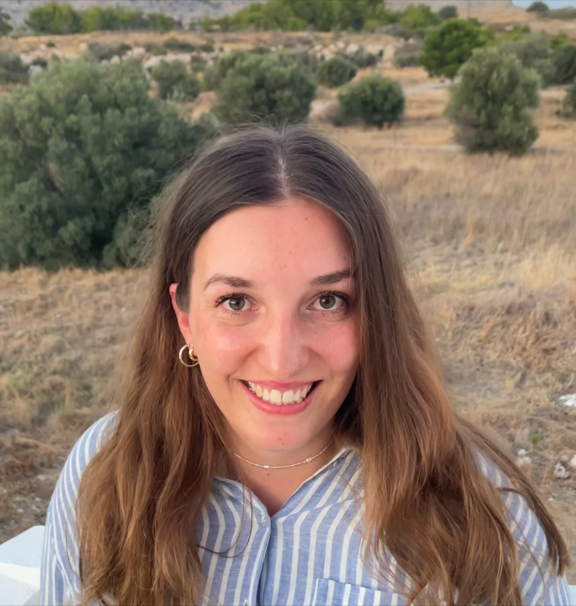

[Home](./index.md)

# Lab members

<table>
<tr>
<td width="120">

</td>
<td>

<b>Melanie I Stefan</b>, Group leader   

My research interests revolve around using computers to understand learning and memory, from simulating how proteins in the brain work together to strengthen the connection between neurons to using educational data to understand how students learn.

<a href="http://melaniestefan.net">more</a>

</td>
</tr>

<tr>
<td width="120">
    
</td>
<td>

<b>Christine Lee</b>, PhD student  
<!-- 2018- -->

My research interests include using software to assist in analyzing student behavior on online test-taking platforms, and to hopefully help teachers better tailor their classes according to their students' needs.

</td>
</tr>

<tr>
<td width="120">
    
</td>
<td>

<b>Danny Schnitzler</b>, Postdoctoral researcher  
<!-- 2023- -->

With a background in neuroendocrinology, I've investigated aspects of anxiety and stress using an in vivo model. While I still have many questions that I want an answer to, the prism of my interests has more recently shifted to focus on developing practical bioinformatics tools for innovative research. These include bioimage analysis, scientific text evaluation, and novel science communication methods. I am passionate about facilitating accessible and collaborative scientific exploration, while also contributing to the neuroscience research landscape.

</td>
</tr>

<tr>
<td width="120">
    
</td>
<td>

<b>Kira Lampert</b>, MD student  
<!-- 2024- -->

I am interested in understanding the intersection of endocrinology and neuroscience, particularly how hormonal fluctuations throughout the menstrual cycle influence neuropsychiatric conditions and neurodivergence. My focus is on how shifts in estrogens, progesterone and other hormones impact the severity and presentation of symptoms in condition such as ADHD, anxiety and mood disorders. I aim to explore how cycle-based medications strategies could offer more tailored and effective treatment options for women with ADHD. 

</td>
</tr>

<tr>
<td width="120">
    
</td>
<td>

<b>Patricia Rubisch</b>, Postdoctoral researcher  
<!-- 2023- -->

I am interested in developmental and learning processes on both the functional and mechanistic level. I believe that exploring the vast heterogeneity of the biological system in health and disease can help to identify which degree of variety is functionally relevant and differentiate them from artefacts of robustness. Using biophysically detailed models, I aim to classify these functional building blocks. By abstracting and transferring  the key mechanisms to circuit models, question of their relevance in network dynamics and systems neuroscience can be explored. A special focus of mine is the influence of inhibition and interneuron activity in the regulation of plasticity for feedback driven learning in neural circuits.

</td>
</tr>

<tr>
<td width="120">
    
</td>

<td>

<b>Susana Rom&aacute;n Garc&iacute;a</b>, PhD student (co-supervised with David Sterratt) 
<!-- 2020- -->

I am interested in using computer models to understand molecular mechanisms which underly memory formation. I believe computer models offer great potential for studying Neuroscience, and I seek to bring the two together in the research that I do. I aim to move away from animal research and towards more ethical technological advancements in the Neuroscience field. My current PhD work involves using various 3D biology computational modelling software (such as MCell and Biodynamo) to create models which look at CaMKII dynamics in the postsynaptic neuron. More specifically, I look at CaMKII interactions with NMDAR and their involvement in biochemical and structural changes in Long Term Potentiation (LTP).

</td>
</tr>

</table>
